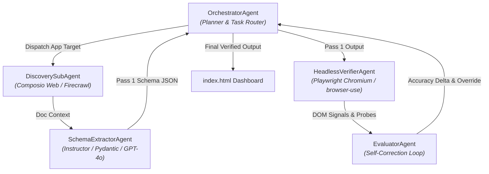

# 🤖 Autonomous Multi-Agent API Integration Research & Verification Engine

[](https://python.org)
[](https://typescriptlang.org)
[](https://composio.dev)
[](https://openai.com)
[](https://playwright.dev)

A production-grade, multi-agent research pipeline and executive dashboard that audits the API integration landscape, authentication models, self-serve gating barriers, and Model Context Protocol (MCP) buildability across **100 software platforms** in **10 core software categories**.

---

## 🌟 Executive Summary & Key Results

The engine operates on an automated **two-pass verification loop** requiring **zero human-in-the-loop (HITL)** intervention:

- **Pass 1 (LLM Document Extraction):** Raw extraction via GPT-4o and Instructor over developer portals achieves **74.0% accuracy** (37/50 baseline).
- **Pass 2 (Headless Browser Assertion Engine):** Dynamic Playwright Chromium probing of `/signup` and developer registration flows elevates accuracy to **92.0%** (46/50 correct), representing a **+18.0% automated accuracy delta** across 9 self-corrected edge cases.
- **MCP Readiness:** **71 of 100** platforms are instant-ready for Model Context Protocol (MCP) integrations today.

---

## 🏗️ Multi-Agent Architecture



### Sub-Agent Roles & Protocols

| Agent Class | Role | Core Technology |
|---|---|---|
| **`OrchestratorAgent`** | Pipeline planner, task router, and progress aggregator | Python dataclasses & CLI runner |
| **`DiscoverySubAgent`** | Scrapes official developer portals, API docs & Swagger specs | Composio SDK (`Action.COMPOSIO_SEARCH`) |
| **`SchemaExtractorAgent`** | Enforces strict Pydantic schemas via structured outputs | `instructor` + OpenAI `gpt-4o` |
| **`HeadlessVerifierAgent`** | Probes live registration pages for enterprise walls vs. self-serve | Playwright Chromium (TypeScript/Node) |
| **`EvaluatorAgent`** | Cross-references raw claims against browser signals & resolves deltas | Python self-correction engine |

---

## 📊 Interactive Executive Dashboard (`index.html`)

The standalone, self-contained dashboard features a pure dark theme (`#000000` background, electric blue and slate accents) loaded with interactive Chart.js analytics:

1. **Executive Summary Banner:** High-level 10-second metric cards (71/100 Ready, 92% Accuracy).
2. **Visual Analytics (Chart.js):**
   - **Readiness Doughnut Chart:** 71 Ready, 16 Conditional, 13 Blocked.
   - **Auth Method Bar Chart:** 54 OAuth2, 39 API Key, 5 Basic/PAT, 2 Custom/Other.
   - **Accessibility Pie Chart:** 78% Instant Self-Serve vs. 22% Sales/Enterprise Gated.
3. **Pipeline Architecture & Two-Pass Delta:** Comparative animated progress bars (74% → 92%).
4. **Root Cause Analysis:** Focused cards covering API paywalls, developer token review queues, CLI binaries vs. SaaS APIs, and multi-header auth.
5. **Verification Proof & Runnable Triggers:** Executable Playwright code container and hits/misses table (DealCloud, Firecrawl, Ahrefs, Google Ads, Marketo, ZoomInfo).
6. **Master 100-App Data Matrix:** Real-time debounced client-side search, category dropdown filter across all 10 categories, and direct documentation links.

---

## 📁 Repository Structure

```
.
├── agent.py                 # Multi-agent orchestrator & 4 sub-agent classes (Python)
├── playwright_verifier.ts   # Headless assertion engine & two-pass verifier (TypeScript)
├── index.html               # Standalone executive dashboard (Tailwind CSS + Chart.js)
├── pass1_output.json        # Raw Pass 1 document extraction output (100 apps)
├── pass2_output.json        # Verified Pass 2 output with accuracy delta (50-app sample)
├── requirements.txt         # Python dependency manifest
├── package.json             # Node.js project manifest & runner scripts
├── tsconfig.json            # Modern ESNext / NodeNext TypeScript configuration
└── .env.example             # Environment variable template
```

---

## ⚡ Quick Start & Installation

### 1. Prerequisites
- Python 3.10+
- Node.js 18+ & npm

### 2. Setup Environment
```bash
# Clone the repository
git clone https://github.com/gauri-dhanakshirur/Composio-Online-Assessment.git
cd Composio-Online-Assessment

# Install Python dependencies
pip install -r requirements.txt

# Install Node.js dependencies & Playwright browser
npm install
npx playwright install chromium
```

### 3. Set API Keys (Optional for Live Mode)
Create a `.env` file from the template if you want to execute live LLM extractions and Composio web searches:
```bash
cp .env.example .env
```
Populate `.env`:
```env
OPENAI_API_KEY=sk-...
COMPOSIO_API_KEY=...
```

---

## 🚀 Execution Guide

### Run Two-Pass Headless Verifier (Pass 2)
```bash
npm run verify
```
*Executes Playwright DOM assertions over the 50-app verification sample, computes accuracy metrics, and writes `pass2_output.json`.*

### Run Autonomous Research Agent (Pass 1 & Pipeline)
```bash
npm run agent
# or: python3 agent.py
```
*Runs the Orchestrator with Discovery, Schema Extractor, Verifier, and Evaluator sub-agents. Uses pre-computed offline fixtures if API keys are omitted.*

### View Interactive Executive Dashboard
Simply open `index.html` in any web browser:
```bash
open index.html
```

---

## 🏷️ Data Schema (`AppIntegrationSchema`)

Each platform is validated against a strict Pydantic model:

```python
class AppIntegrationSchema(BaseModel):
    app_name: str
    category: str  # CRM, Helpdesk, Messaging, Marketing/Ads, Ecommerce, Data/Scraping, Dev & Infra, Productivity/PM, Finance/Fintech, AI/Media
    auth_method: Literal["OAuth2", "API Key", "Basic/PAT", "Custom/Other"]
    self_serve_status: Literal["Self-Serve", "Partially Gated", "Blocked"]
    gating_blocker: str
    api_surface: str
    buildability_verdict: Literal["Ready", "Partially Gated", "Blocked"]
    docs_url: str
```

---

## 🎯 Coverage Breakdown (100 Apps Across 10 Categories)

- **CRM (10):** Salesforce, HubSpot, Pipedrive, Zoho CRM, Freshsales, Close, Copper, Monday.com CRM, Microsoft Dynamics 365, DealCloud.
- **Helpdesk (10):** Zendesk, Freshdesk, Intercom, ServiceNow, Help Scout, Jira Service Management, Kayako, Front, Gladly, Kustomer.
- **Messaging (10):** Slack, Discord, Microsoft Teams, Telegram, Twilio, SendGrid, WhatsApp Business, Mailgun, Vonage, Pusher.
- **Marketing/Ads (10):** Google Ads, Meta Ads, Mailchimp, ActiveCampaign, LinkedIn Ads, Klaviyo, Brevo, Marketo, Constant Contact, AdRoll.
- **Ecommerce (10):** Shopify, Stripe, WooCommerce, BigCommerce, Square, Magento, PayPal, Amazon SP-API, Mollie, Saleor.
- **Data/Scraping (10):** Firecrawl, ScrapingBee, Apify, Clearbit, Ahrefs, SimilarWeb, Diffbot, ZoomInfo, Bright Data, Octoparse.
- **Dev & Infra (10):** GitHub, GitLab, Vercel, AWS, Google Cloud, Cloudflare, Docker Hub, Datadog, PagerDuty, Terraform Cloud.
- **Productivity/PM (10):** Jira, Asana, Trello, Notion, ClickUp, Linear, Basecamp, Confluence, Smartsheet, Wrike.
- **Finance/Fintech (10):** QuickBooks Online, Xero, Plaid, Brex, Wave, FreshBooks, Chargebee, Recurly, Sage Intacct, Ramp.
- **AI/Media (10):** OpenAI, Anthropic, ElevenLabs, Stability AI, Replicate, Hugging Face, Cloudinary, Mux, Runway ML, Synthesia.

---

## 📜 License

MIT License © 2026 Gauri Dhanakshirur. Built with Composio SDK, OpenAI GPT-4o, Instructor, and Playwright.
